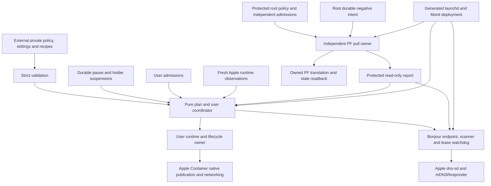

# Netorch

[](https://github.com/mglaeser/network-orchestrator/actions/workflows/ci.yml)

A reusable deployment and orchestration framework for container networking on
macOS: strict private policy, Apple Container observation, independent PF
forwarding, native Bonjour import/export, launchd/Monit supervision and guarded
recovery. Site configuration lives outside the public repository.

Netorch answers **what is intended, admitted, observed, applied, paused and in
transition**, then asks the appropriate independent owner to act. It supplies
executable owners and installers rather than requiring each site to implement
those interfaces from scratch.

## Status and boundaries

Version **0.2** includes the complete macOS deployment layer:

- Typed Apple Container reader, existing-definition enrollment, native publication
  readback and a guarded proven-stopped start operation.
- Explicit digest-bound initial provisioning for missing declared workloads;
  existing definitions are never automatically replaced or recreated.
- A user-owned native `dns-sd` scanner and independently supervised registration
  watchdog for genuine guest exports and Apple media imports.
- An independent administrator-owned PF pull service with protected policy,
  content/code-bound admissions, readback, withdrawal and state draining.
- Deterministic launchd/Monit bundles, separate user/root installation, phase-aware
  failed-install recovery and committed-release rollback.
- Portable mock/process/property testing and reproducible Python packaging.

This remains a young framework. Public CI proves model, parser, owner and installer
contracts; it does not certify Darwin PF packets, real user Bonjour consent,
application reconnect or audible playback. These have separate
[acceptance gates](docs/testing.md). No production deployment is performed by
cloning, building, testing or running the demonstration.

The user coordinator never invokes root, embeds `sudo`, opens privileged RPC or
silently grants admission. Native Apple tools carry packets and resolve names;
Netorch does not introduce a VM, raw mDNS stack, general reflector or compiled
network adapter. Runtime upgrades, login/security settings and application
integrations remain separately owned decisions.

## Goals

1. **Highly robust:** fence service/network identity, withdraw uncertain exposure,
   preserve operator pause and make partial failures explicit.
2. **Easy to maintain:** one author per setting, closed versioned contracts,
   independent small owners and deterministic deployment.
3. **Well tested and efficient:** pure plans, property/failure tests, bounded
   subprocesses, no-op readback and measured native acceptance.
4. **One coherent setup:** shared policy/status and installation without merging
   root, user, runtime and application authority.

Wrong-target forwarding, silent authority expansion, lost pause, unknown treated
as success and hidden destructive recovery are release blockers. See
[architecture](docs/architecture.md) and [review traceability](docs/review-traceability.md)
for the design and its evidence limits.

## Quick start: no network changes

Use managed Python 3.12, 3.13 or 3.14. The project does not install the interpreter,
Monit or Apple Container.

```sh
git clone https://github.com/mglaeser/network-orchestrator.git
cd network-orchestrator
python3 -m venv .venv
.venv/bin/python -m pip install --require-hashes -r requirements-dev-lock.txt
.venv/bin/python -m pip install --no-deps --no-build-isolation -e .
.venv/bin/netorch validate --config examples/network.json
.venv/bin/netorch simulate --config examples/network.json
.venv/bin/netorch demo
```

The synthetic examples use documentation-only address ranges. The demonstration
works on Linux or macOS without root, a runtime, network changes or playback.
Its changes are confined to mock state. `demo` also works from an installed wheel
outside the checkout.

For runtime-only installation, obtain/build a reviewed wheel and install it after
the runtime hash lock. The development lock above also includes the pinned build
backend needed for an editable source installation.

## Architecture



There is no coordinator→root action path. Root independently pulls installed
policy and fresh runtime/kernel facts. A protected report can establish downstream
read-only dependency readiness; it cannot authorize user changes to root policy.

| Component | Owner/type | Responsibility |
|---|---|---|
| Apple Container and native helpers | Vendor/native | Guest networking, addresses, host socket publication |
| PF, launchd, `dns-sd`, `mDNSResponder` | Native macOS | Packet translation/state, scheduling and discovery packets |
| Monit | Maintained third party | Bounded health checks and guarded proven-stopped recovery |
| Netorch Python | Custom | Strict tables, identity, plans, owners, supervision and deployment |
| Fixed PF Bash backend | Custom | Small protected native mutation boundary |
| Applications/reverse proxies/router | Existing independent owners | Secrets, pairing, routes, DNS policy, TLS and application behavior |

## Policy and data ownership

All addresses, interface names, service identities, publication ranges, provider
paths and deployment locations are operator data. Logic lives in typed modules.
Keep real site files outside the checkout; public examples are shapes to adapt,
not production defaults.

| Record | Meaning | Authority |
|---|---|---|
| Policy/settings | Reviewed scopes, services, transports, discovery and runtime contracts | One site source or generated owner view |
| Admission | Exact resolved content approval | Independent user/root approving owner |
| Observation | Complete bounded read, time/reason and instance/network generation | Current platform reader |
| Receipt | Verified past completion | Historical evidence only |
| Intent/journal | Pause, holder suspension and operation phase | Durable state outside release files |

Changing authority-relevant data or bound root implementation semantics makes the
profile pending. A name alone never carries admission. Unknown is not absent,
healthy or a reason to recover. Rollback preserves current operator pause.

Shared dynamic guest addresses cannot provide an absolute zero-misdelivery
promise through polling. Direct guest and UDP-return strategies require explicit
bounded-risk acceptance, fresh target identity, withdrawal, retained-state drain
and readback. A requirement for structural exclusivity needs a separately reviewed
network architecture. The [deployment guide](docs/deployment.md) explains this gate.

Bonjour registration is a dependency-gated lease over genuine records. Export
requires the same announcing service's verified publication, not a coincident
port. Import supports multiple changing-address Apple media devices and related
endpoints. An independent watchdog withdraws registrations after stale proof,
parent/child exit, pause or generation change. TXT remains lossless binary data.

## Deploying an entire site

Follow [getting started](docs/getting-started.md), then supply private network,
runtime, discovery, provider and deployment tables. The framework can generate
and install the complete custom networking setup, including all declared
forwarding, native publications, both selected-record discovery directions,
monitoring and workload recovery. It preserves application configuration and
vendor/runtime ownership.

The [configuration guide](docs/configuration.md) explains policy tables;
[Apple runtime](docs/apple-runtime.md) covers enrollment/observation;
[workloads](docs/workloads.md) covers optional explicit initial provisioning.
[Bonjour](docs/bonjour-owner.md), [PF](docs/pf-owner.md) and
[provisioning](docs/provisioning.md) document executable owners and installation.

Build and inspect a bundle without network changes:

```sh
netorch deploy validate --manifest /operator/site/deployment.json
netorch deploy build --manifest /operator/site/deployment.json \
  --config /operator/site/network.json --output /operator/staging/bundle
netorch deploy verify --bundle /operator/staging/bundle
netorch deploy plan --bundle /operator/staging/bundle --scope user
netorch deploy plan --bundle /operator/staging/bundle --scope root
```

Replace all placeholder paths and example hashes. Explicit `install-user` and a
separate administrator-owned `install-root` operation fence the reviewed bundle
digest. Initial intent is paused and new root profiles are unadmitted. The user
installer cannot invoke the root installer. There is no automatic production
recreation, runtime upgrade or login-policy change.

Exactly one owner writes each resource. During migration, derive settings from
existing sources, then make old inputs generated in the same reviewed ownership
flip. Never leave two hand-edited copies or overlapping Bonjour publishers.
Private applications retain credentials, Home Assistant state, pairings and data.

## Testing and CI

```sh
.venv/bin/python -m pytest -m 'not acceptance' --cov=netorch --cov-branch --cov-report=term-missing
.venv/bin/ruff check .
.venv/bin/ruff format --check .
.venv/bin/mypy
.venv/bin/python -m build --no-isolation
.venv/bin/pip-audit -r requirements-dev-lock.txt --strict
```

CI runs Linux/Python 3.12–3.14 and macOS/Python 3.14, enforces at least 90%
combined line/branch coverage, validates examples, builds distributions and runs
an installed wheel outside the checkout. Fake tool/process/temporary-root tests
exercise the real owners and installer, not a stub deployment. GitHub workflows
have read-only permissions and SHA-pinned actions.

No public test changes native networking. Hardware, destructive lifecycle and
application/person acceptance remain distinct tiers in the [test guide](docs/testing.md).
Dependency and Action updates are reviewable PRs, never automatic runtime upgrades.

## Repository layout

```text
src/netorch/          typed models, planners, owners, readers, provisioning and CLI
schemas/              closed versioned policy/deployment JSON schemas
platform/macos/       fixed PF backend and native deployment examples
examples/             synthetic policy, settings, deployment and mock evidence
tests/                unit, property, process, reader and temporary-root regressions
docs/                 architecture, operator contracts and evidence gates
requirements*.txt     reviewed dependency inputs and complete hashed locks
.github/              CI, advisory checks, updates and contribution templates
```

Read [CONTRIBUTING.md](CONTRIBUTING.md) and [SECURITY.md](SECURITY.md). Use synthetic
or redacted reports; keep credentials, account paths, installation names, raw
inspect output and packet payloads out of public issues and fixtures.

Licensed under [MIT](LICENSE).
