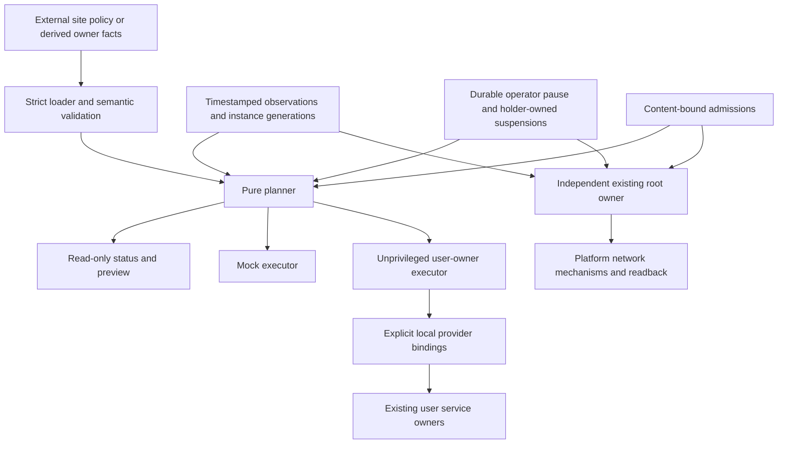

# Netorch

[](https://github.com/mglaeser/network-orchestrator/actions/workflows/ci.yml)

Network policy orchestration over independent platform owners, with a portable
model, strict configuration, explicit admission, and a fully simulated backend.

Netorch helps an operator answer: **What is intended, what is actually observed,
what is admitted, what is paused, and what should the existing owner do next?**
Site addresses, interface names, service identities, ports, provider bindings and
runtime observations are supplied as external data. No real installation data is
shipped in this repository. Examples use documentation-only address ranges.

## Status and boundaries

This is an initial **alpha framework**, not a certified replacement for a platform
network stack. Pure orchestration, state persistence, mocked reconciliation,
configuration derivation, previews, and user-owner protocol adapters are
implemented. Discovery lease decisions and a fixed user-owner reconciliation
protocol are included; the existing publisher implements real registrations.
A mock demonstration runs on Linux or macOS without root, a
container runtime, network changes or audio playback.

The unprivileged coordinator never invokes an `external-root` owner. Existing
privileged owners independently read their admitted snapshots and perform their
own observations and readback. A plan that needs such an owner reports that
requirement. There is no embedded `sudo`, privileged service installer, runtime
upgrade, global firewall mutation, or automatic production deployment.

Passing public CI establishes model and adapter contracts. It does not establish
Darwin packet-filter semantics, container NAT, real Bonjour consent, application
discovery, or audible playback. Those have separate acceptance gates in the
[deployment guide](docs/deployment.md).

## Goals

1. **Correctness and recovery:** preserve service identity, fail closed on unknown
   state, stop writes after a partial failure, and expose the recovery phase.
2. **Maintainability:** one authoring location per setting, closed versioned data
   contracts, independent owner modules, and reproducible installation.
3. **Privilege boundaries:** bind admission to resolved content; configuration and
   an unprivileged planner cannot silently expand root authority.
4. **Observability and testing:** report desired, admitted, observed, applied and
   transition state separately; reproduce failures through injected clocks and
   fake owners.
5. **Operational cost:** use existing platform mechanisms and maintained libraries,
   avoid adding a permanent all-powerful daemon, and bound subprocess work.

Wrong-target forwarding, implicit authority expansion, lost operator pause,
unknown treated as healthy, or hidden destructive recovery are release blockers.
A weighted score cannot compensate for any of these failures.

## Quick start: no network changes

Requires a managed Python 3.12, 3.13 or 3.14. The project does not install an
interpreter or a native container runtime.

```sh
git clone https://github.com/mglaeser/network-orchestrator.git
cd network-orchestrator
python3 -m venv .venv
.venv/bin/python -m pip install --require-hashes -r requirements-dev-lock.txt
.venv/bin/python -m pip install --no-deps --no-build-isolation -e .
.venv/bin/netorch validate --config examples/network.json
.venv/bin/netorch simulate --config examples/network.json
```

`netorch demo` is a bundled equivalent of the simulated example and also works
from an installed wheel without the repository checkout. Its changes are confined
to mock state. No mock result is reported as hardware acceptance.

For a runtime-only installation, build or obtain a reviewed wheel and install it
after the runtime hash lock. The development lock is used above because it also
contains the pinned build backend needed for an editable source install.

## Read-only workflows

Validate policy and view a plan against synthetic observations:

```sh
.venv/bin/netorch plan \
  --config examples/network.json \
  --snapshot examples/snapshot.json \
  --admissions examples/admissions.json \
  --intent examples/intent.json \
  --now 1000

.venv/bin/netorch status \
  --config examples/network.json \
  --snapshot examples/snapshot.json \
  --admissions examples/admissions.json \
  --intent examples/intent.json \
  --now 1000
```

Derive a catalog from literal owner facts:

```sh
mkdir -p "$HOME/.local/state/netorch"
.venv/bin/netorch derive \
  --source examples/owner-facts.json \
  --output "$HOME/.local/state/netorch/catalog.json"
```

Derivation reads data; it never sources a shell file or evaluates expressions.
Keep each setting authored once. During migration the existing owner remains the
source, and the catalog is generated. Flip ownership only when the old input
becomes generated in the same reviewed change, with equivalence tests.

## Architecture



The last branch is an integration contract: Netorch's user executor does not
call the root owner. Every existing root implementation must enforce admission,
scope, generation, pause, state invalidation and readback at its own boundary.

Native operating-system and runtime facilities still carry packets and resolve
names. Existing service managers still own workload lifecycle. Netorch owns the
portable policy vocabulary, orchestration decisions and operator view.

### Data ownership

| Record | Meaning | Authority |
|---|---|---|
| Policy | Reviewed service, scope, transport and discovery declarations | Site author or generated owner view |
| Admission | Profile plus SHA-256 of all resolved authority-relevant content | Independently approving owner |
| Observation | Complete timestamped read, reason, instance/network generation | Current bounded reader |
| Applied receipt | Last completed operation and readback evidence | Historical evidence only |
| Intent/journal | Operator pause, holder-owned suspension and operation phase | Durable state, outside release files |

Changing a profile, scope, owner or service contract changes admission content.
The profile becomes pending rather than automatically inheriting old approval.
Fresh unknown state cannot initiate recovery. Stale or mismatched live targets
must be withdrawn, and retained packet states must be accounted for by the
platform owner. A receipt never proves current kernel state.

Content hashes cannot detect a change in what implementation code means. A
transport or discovery behavior change must bump the relevant digest strategy or
schema version, or be covered by an independently enforced, versioned owner
implementation contract. An old admission must not silently authorize new
semantics.

### Modules and layout

```text
src/netorch/        policy, readers, planning, execution, persistence and CLI
examples/           synthetic policy, observations, admissions and owner facts
tests/              unit, property, mock, process and reader-contract tests
docs/               implementation, acceptance, deployment and testing contracts
.github/            CI, dependency updates and contribution templates
requirements*.txt   reviewed dependency inputs and complete hashed locks
```

The schema and frozen dataclasses describe scopes, owners, services, profiles and
discovery declarations. Ports and address bindings are data; executable provider
paths are explicitly trusted local bindings kept outside the checkout.
Application secrets, pairings, integrations, certificates and application
configuration remain owned by their applications.

## Connecting a real installation

Copy and edit the synthetic policy outside the checkout. Provide private runtime
bindings for the user-owned JSON provider protocol. Read the
[deployment guide](docs/deployment.md) and the implementation contract before
invoking a real provider.

The [configuration guide](docs/configuration.md) explains each table, digest and
operator-supplied file. The [owner protocol](docs/owner-protocol.md) defines the
adapter boundary, and [review traceability](docs/review-traceability.md) maps the
design's safety gates to implementation and evidence.

Start with `validate`, `derive`, `plan`, `status` and `observe`. `init-state`
creates durable intent paused by default. A live user-owner `reconcile` uses
explicit local bindings and a separate state directory, and returns a plan until
`--execute-user-owners` is supplied. It refuses to execute external-root actions.
The root owner must be integrated and accepted independently; this project does
not transfer trust to it automatically. See the [state machine](docs/state-machine.md)
for partial completion and explicit journal acknowledgement.

Direct guest rules on a shared address pool cannot promise zero misdelivery from
polling alone. This release supports explicit bounded risk policies for direct
guest and UDP-return profiles, enforced by their independent owner. It does not
model proof of exclusive ownership for a structural guest boundary. A JSON field
cannot supply that missing platform guarantee. See
[deployment gates](docs/deployment.md).

Discovery is a dependency-gated lease, not an embedded DNS-SD stack. The existing
user publisher receives the fixed `reconcile-discovery` request with resolved
policy, its exact digest and expected service/network generations. It independently
checks eligible source records, interface identity and verified transport before
publishing. Missing publisher evidence or an unconfirmed interface yields cleanup
intent rather than publication. The coordinator processes discovery cleanup before
transport operations and reports incomplete cleanup as pending or inhibited;
newly repaired transport requires a fresh verified observation on a later cycle
before discovery can activate. See the
[owner protocol](docs/owner-protocol.md).

## Testing and CI

```sh
.venv/bin/python -m pytest --cov=netorch --cov-branch --cov-report=term-missing
.venv/bin/ruff check .
.venv/bin/ruff format --check .
.venv/bin/mypy
.venv/bin/python -m build --no-isolation
.venv/bin/pip-audit -r requirements-lock.txt --strict
```

CI runs Linux with Python 3.12–3.14 and macOS with Python 3.14, validates the
examples, exercises mocks, enforces branch-aware coverage of at least 90%, checks
format/types, builds distributions, and smoke-tests an installed wheel from a
directory outside the checkout. Workflows use read-only repository permissions
and SHA-pinned actions; no credentials or production host are required.

The [test guide](docs/testing.md) describes the tiers and what each proves.
Dependency changes and action updates are reviewable pull requests, not automatic
runtime upgrades. Current installed/tested dependency versions are locked; library
maintenance is an ongoing task, not a one-time claim of future safety.

## Contributing and security

Read [CONTRIBUTING.md](CONTRIBUTING.md) and [SECURITY.md](SECURITY.md). Please use
synthetic or redacted reproductions. Keep addresses, names, account paths,
credentials, packet payloads and private runtime snapshots out of public issues
and fixtures.

Licensed under [MIT](LICENSE).
