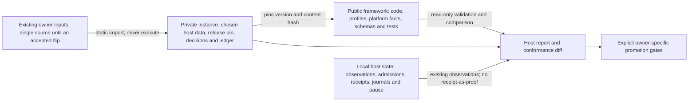

# Netorch

[](https://github.com/mglaeser/network-orchestrator/actions/workflows/ci.yml)

A host-independent, macOS-only framework for understanding and carefully
extracting an existing Apple Container networking setup. Each host supplies
private data; the public framework supplies closed models, named strategies,
static importers, conformance checks and truthful read-only reports.

## Current release boundary

Version **0.4** implements the reviewed extraction stage. The recommended
`netorch-host` workflow has exactly seven read-only operations: `validate`,
`preflight`, `status`, `plan`, `check`, `report` and `supervision-gaps`. It
never opens a LAN socket, uses Bonjour, executes an owner, admits policy,
restarts a workload or plays audio.
Only an explicit `--collect-local` reads fixed local macOS facts.

The candidate platform is macOS **27.0.1, build 26A434**, Apple silicon and
Apple Container **1.5.0**. Parser compatibility is separate from supported
production behavior. The hardware-qualified support matrix starts empty:
synthetic examples, hosted CI, declarations and signed residuals cannot qualify
an installation. An existing older runtime can be inventoried read-only.

Version 0.2 owner/installer mechanisms are retained for semantic regression and
mock testing. Native activation and installation through their public entrypoints
are gated pending a separately accepted owner flip. Existing installed owners
are preserved; this release does not replace them, add a supervisor or create a
second writer. Explicit scoped withdrawal remains a safety operation.

See [the instance guide](docs/instances.md), [review traceability](docs/review-traceability.md)
and [migration rules](docs/site-migration.md). No production qualification,
application acceptance or unattended recovery is implied by installing a wheel.
The [latest adversarial review](docs/reviews/2026-10-08-site-requirements-review.md)
records the 0.4.0 corrections, proposal dispositions and remaining conformance gates.

## Goals and hard gates

1. **Robust:** preserve identity, negative intent and independently admitted scope;
   make uncertain observations explicit.
2. **Maintainable:** one authoring location per setting; host data, profiles and
   platform facts live in distinct places.
3. **Well tested and efficient:** strict models, property/failure tests, bounded
   local reads and evidence at the tier that proves the claim.
4. **One coherent workflow:** shared read-only status without combining user,
   root, runtime and application authority.

Wrong-target forwarding, implicit authority expansion, lost pause, unknown
triggering recovery and hidden destructive operations are blockers. A direct
shared-pool guest target has a bounded residual, never an absolute zero-misdelivery
certificate. Every requirement has a proving test and a per-host fulfilment state.

## Three places



The framework never refers to an instance. An instance contains data only: no
shell, executable paths, templates, raw PF text, expressions or plug-ins. Live
guest and receiver addresses and preflight observations belong to local state.
Application secrets and configuration remain with their existing owners.

For an existing site, the instance begins as a generated view. Re-import must
reproduce its bytes. Each owner flips individually only when rendered inputs
match the frozen inputs byte for byte, including headers and newlines. Changes
to ports, names, paths, admission defaults or behavior require their own declared
change and acceptance. No second hand-edited source is introduced.

## Native, maintained and custom components

| Type | Components | Responsibility |
|---|---|---|
| Native Apple | Container, PF, launchd, dns-sd, mDNSResponder | Existing runtime, packet/state semantics, scheduling and discovery |
| Maintained third party | Monit; jsonschema; pytest and Hypothesis | Existing supervision, closed validation and regression/property testing |
| Custom Python | Instance/import/conformance/privacy/report libraries | Typed data, provenance, requirements, evidence and read-only workflow |
| Retained owner scripts | Fixed PF boundary and version 0.2 owner mechanisms | Independently reviewed semantics; staged for an explicit future owner flip |
| Existing applications | Proxies, DNS filtering, automation and management tools | Application data, pairing, credentials, TLS and independent lifecycle decisions |

No compiled adapter, second mDNS stack, additional VM, general reflector,
configuration UI, remote management or plug-in architecture is introduced.
The platform contract records exact upstream versions, sources, tests and
retirement triggers. Polling remains a platform limitation, not a fabricated
lifecycle API.

## Read-only quick start

Use an already managed Python 3.12, 3.13 or 3.14 on macOS. This project does not
install or upgrade Python, Container, Monit, kernels or application dependencies.

```sh
git clone https://github.com/mglaeser/network-orchestrator.git
cd network-orchestrator
python3 -m venv .venv
.venv/bin/python -m pip install --require-hashes -r requirements-dev-lock.txt
.venv/bin/python -m pip install --no-deps --no-build-isolation -e .
.venv/bin/netorch-host --instance examples/instance.json validate
.venv/bin/netorch-host --instance examples/instance.json plan
.venv/bin/netorch-host --instance examples/instance.json report
```

The synthetic instance uses documentation addresses and placeholder release
identities; it intentionally has no hardware acceptance or approved residual.
Its report must not claim that the host is ready. Supply a real pinned framework
artifact and external evidence when reviewing a private instance.

The [static import guide](docs/legacy-import.md) covers existing inputs, provenance,
underivable expressions, authority flips and both literal checks. The
[safety contract](docs/safety-contract.md) explains T/K, scheduling uncertainty,
FIFO address reuse and the reserved recovery code. The
[testing guide](docs/testing.md) separates portable logic from real macOS and
physical-host evidence; CI itself runs only on macOS.

## Status and fulfilment

A report keeps desired, admitted, observed, applied and paused/pending state
separate. Each observation has its own age, generation and closed reason.
Discovery and transport remain distinct: a discoverable receiver can have a
withdrawn return path. A receipt establishes historical completion only.

Requirements report **fulfilled and verified**, **unverified**,
**accepted residual**, **not applicable** or **not fulfilled**. A missing signature,
missing restore/reboot evidence, unreadable owner state or incomplete conformance
remains visible. A warm application cache is not proof of live discovery; player
state is not proof of audible playback.

## Testing

```sh
.venv/bin/python -m pytest -m 'not acceptance' --cov=netorch --cov-branch
.venv/bin/ruff check .
.venv/bin/ruff format --check .
.venv/bin/mypy
.venv/bin/python -m netorch.privacy_check --root . --exceptions schemas/privacy-exceptions.json
.venv/bin/python -m build --no-isolation
.venv/bin/pip-audit -r requirements-dev-lock.txt --strict
```

All CI jobs run on macOS, with Python 3.12–3.14 and a 90% combined line/branch
coverage gate. The `netorch.privacy_check` line is the public host-data guard
that CI runs: it reports private addresses, interface names, home paths and
site-like namespaces in tracked and not yet committed files, and an exception
must name the exact path, kind and value hash in `schemas/privacy-exceptions.json`.
Tests use synthetic fixtures, temporary roots and fake effects;
installed-wheel checks run outside the checkout. Native PF checks compile only
and never load rules. No CI job runs guests, plays audio or qualifies a production
host. Workflows have read-only permissions, SHA-pinned actions and hash-locked
dependencies. The scheduled audit proposes no automatic deployment.

## Repository layout

- `src/netorch/`: closed instance/evidence models, profile/platform/requirement
  libraries, importer, conformance/privacy checks, read-only CLI and retained owners.
- `schemas/`: versioned data schemas; unknown versions are refused.
- `examples/`: two synthetic instances and content-addressed data contracts;
  older owner fixtures remain laboratory examples.
- `tests/`: strictness, property, process, privilege, uncertainty and failure tests.
- `docs/`: architecture, ownership, migration, acceptance and review traceability.
- `platform/`: retained fixed native boundary and supervision documentation.

See [CONTRIBUTING](CONTRIBUTING.md) and [SECURITY](SECURITY.md). MIT licensed.
