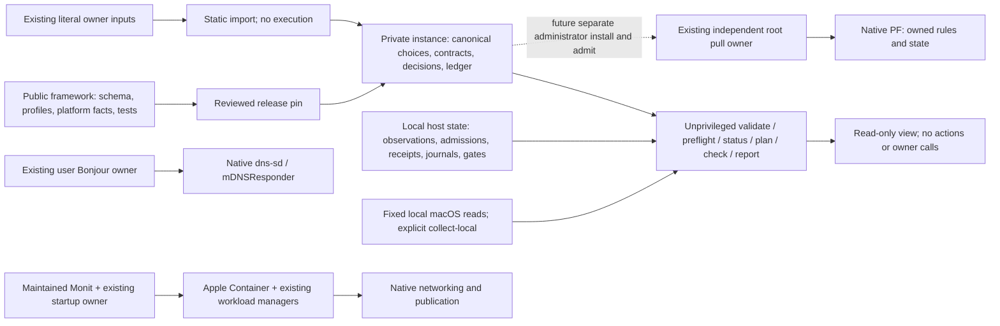

# Architecture

Version 0.3 is a macOS-only, read-only extraction stage. It supplies a closed
instance model, static legacy import, byte conformance checks, a requirements
registry and a six-verb host view. It preserves existing installed networking
owners. It does not migrate a host, grant admission, upgrade the runtime or
certify physical behavior. The native-qualified support matrix is empty.

## Goals and hard gates

The goals are correctness and recovery, maintainability and reproducible
provisioning, explicit privilege boundaries, useful test evidence and modest
operational cost. Consolidation means one vocabulary and one view, while packet,
discovery, application and runtime authorities remain separate.

Wrong-target delivery, implicit authority expansion, lost pause, unknown treated
as healthy or as restart permission, hidden destructive recovery and any
unprivileged call into root block promotion. Direct rules naming recyclable
guest addresses have a signed residual; polling cannot make them structurally
exclusive. A synthetic test or weighted score cannot close a native gate.

## Three places, one-way dependency

There is no report/planner-to-root execution path. The instance pins a framework
artifact and dependency lock. The framework never imports an instance. Root code
changes only through an independently reviewed administrative installation.

| Place | Data | Authority |
|---|---|---|
| Public framework | Closed schemas, named strategies/application profiles, sourced platform facts, requirements/tests, synthetic examples | Reviewed release code; no real host values or acceptance |
| Private instance repository | Canonical static choices, content-referenced workload contracts, pinned names, authoring provenance, decisions, deviations and acceptance ledger | Desired data only; no scripts, executable paths, PF text, secrets, live guest/receiver addresses |
| Local host state, outside Git | Fresh observations, root admission, receipts, journals, durable pause and holder suspensions, preflight and application data | Owners' current records; a receipt is historical, never kernel truth |

`instance_model` and `instance` validate canonical closed JSON. `profile_library`
contains fixed behavior names and versions; `platform_contract` keeps upstream
facts and candidate versions separate from an empty hardware-qualified matrix.
`requirements` provides stable requirement IDs, applicability and proving tests.
`legacy_import` parses literal JSON/plist/TOML/environment/list data without
sourcing it; code is inventoried by hash and otherwise underivable. `conformance`
compares captured and rendered bytes, including whitespace and provenance.
`host_report` joins declared data to typed retained evidence. `macos_preflight`
uses bounded fixed local readers, not network probes. `workflow_gate` refuses
native authority expansion before the retained owner entrypoints touch state.

## Configuration versus runtime observations

One IPv4 LAN is declared by stable adapter identity, expected address and scope.
Its current interface name is observed. The runtime network name is a choice;
guest addresses, receiver addresses, bridge names and current generations are
observations. They never become desired instance data. IPv6 remains outside the
custom policy, not asserted blocked. A named socket range is referenced once by
the workload and transport contract; exhaustion cannot widen it automatically.

Each profile view keeps desired, admitted, observed, applied and historical
receipt state separate. Observations have present/absent/unknown, a closed reason
and their own age. Dependency composites can say that discovery is present while
transport is withdrawn. Unknown cannot authorize recovery. A reserved status 42
is meaningful only after a complete proven-stopped check and allowed gates.

Operator pause and operation-owned suspension are durable independent records.
The effective gate is their union; no timer expires them. A hold is a third
record of the same kind that inhibits one service only. Installation and
rollback preserve the current pause, holds and unrelated holders. Unreadable or old
state inhibits operation. Signatures in a ledger are owner attestations bound
to retained evidence; they are not authenticated root admissions.

## Retained packet and name mechanisms

| Path | Mechanism | Classification and limits |
|---|---|---|
| LAN to published port | Workload-specific Apple Container forwarder | Vendor/native; publication identity must match the announcing service |
| LAN ingress to an existing host publication | Owned scoped PF redirect | Native PF plus existing custom owner; structural same-service target. Sources outside the LAN prefix only where the profile declares an unrestricted source and root acknowledges it separately |
| Direct DNS ingress with client identity | Owned direct-to-guest PF redirect | Bounded shared-pool address risk; separate publication does not replace it |
| Dynamic UDP return | Static-port outbound NAT and target-less inbound RDR | Existing custom PF shapes; LAN-wide, one admitted range, multiple receivers |
| Application LAN alias | Existing workload setup, ordinary vendor NAT | Named application contract; preserve current behavior and deviations |
| Guest Bonjour export | Genuine record and corresponding publication projected outward | Existing custom selection, native Apple record registration |
| Apple-media import | Genuine eligible records projected onto the guest link | Existing custom selection, native DNS-SD; depends on verified transport |
| Ordinary guest egress/peer paths | Existing runtime network | Vendor/native; no replacement packet stack |

Neither a listener nor process exit zero proves service identity or registration.
The retained Bonjour implementation fences genuine records, own publications,
interface ownership/nonzero index, exact callbacks and independent lease expiry.
A warm application cache is insufficient evidence of a live inward projection.

PF is a site-administration facility, not an Apple-supported application API.
Root independently reads admitted parameters, observes live targets, checks gates,
loads only owned shapes and verifies rules/states. It never accepts planner
commands, broad pass rules, global state flushes or a PF-disable request. Anchor
names/order are semantic; namespace changes need their own acceptance.
See [Apple TN3165](https://developer.apple.com/documentation/technotes/tn3165-packet-filter-is-not-api).

## Tools, testing and promotion

Native Apple Container, PF, launchd, dns-sd and mDNSResponder continue handling
packets and records. Maintained Monit keeps its existing supervision role.
Managed Python with jsonschema supplies typed offline/local tools and test seams;
the small retained Bash PF backend stays independently owned. No Swift/Go/Rust
adapter, general reflector, plug-in system, extra VM, UI or networking daemon is
introduced. A new adapter needs demonstrated parser failure, a reviewer and an
accepted signing/Local Network consent identity before a spike.

CI is macOS-only, with Python 3.12–3.14, strict types/lint, property/mock/process
regressions, privacy checks, package smoke tests and PF grammar compilation only.
It proves no guest packets, production kernel hook order, physical audio, consent,
restore or unattended reboot. Candidate parser support is not host acceptance.
[Testing](testing.md), [review traceability](review-traceability.md) and
[migration](site-migration.md) define the evidence and stop conditions.

Owner parameterization follows byte-identical conformance, one owner per commit:
Bonjour, recovery/supervisor, workloads one at a time, then root inputs. Existing
names and state paths stay pinned. Any behavioral difference ships separately.
An inaccessible source or installed/source drift blocks the owner flip; it does
not justify inventing a replacement configuration. Runtime upgrades and restore
rehearsals remain separate approved maintenance operations.
