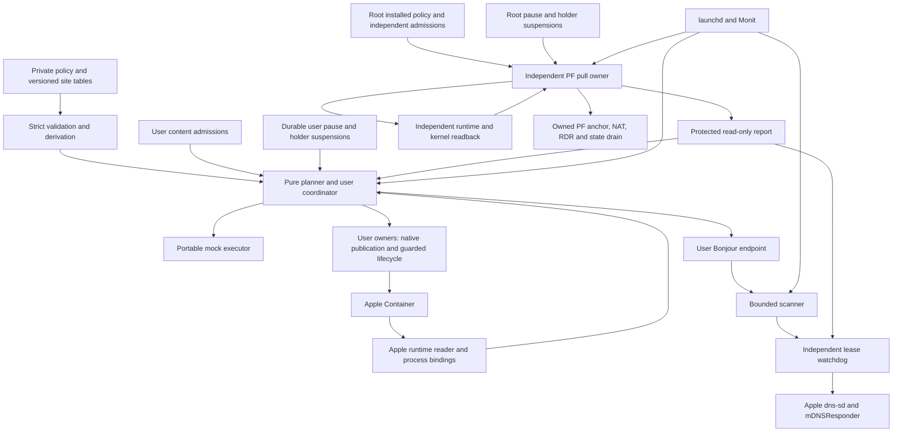

# Architecture

Netorch is a complete deployment and orchestration layer for native macOS
container networking. It combines a typed Python control plane, an independent
administrator-owned PF service, a user-owned native Bonjour service, Apple
Container readers and guarded workload lifecycle operations. Native OS and
runtime components continue to carry packets. There is no new multicast stack,
permanent privileged RPC server or virtual machine.

The release supplies executable owners, deterministic launchd/Monit bundles,
protected installation, rollback and mock acceptance. Production adoption remains
an explicit installation decision; portable CI cannot certify Darwin packet
semantics, user consent, physical devices or unattended reboot behavior.

## Design goals and release gates

1. **Robustness:** retain workload identity, withdraw uncertain exposure, preserve
   operator intent and make interrupted operations recoverable.
2. **Maintainability:** one authoring location per setting, strict versioned data,
   small independently owned modules and reproducible release artifacts.
3. **Testability and cost:** pure plans, injected clocks/readers, meaningful failure
   tests, bounded process work and measured native acceptance.
4. **Consolidation:** one policy vocabulary and operator workflow without merging
   application, runtime, packet-filter and discovery privileges.

Wrong-target forwarding, implicit admission, lost pause, unknown treated as
success and concealed partial completion are release blockers. A weighted score,
new programming language or smaller process count cannot compensate for them.
See [review traceability](review-traceability.md) for the exact evidence boundaries.

There is no coordinator execution arrow into root. An administrator installs a
protected PF policy, and the root job independently pulls it, checks its own
admissions and observes live state. An unprivileged desired catalog or plan never
becomes root authority. User owners can read the root report, but cannot send root
an address, command, range or action.

## Where data and logic live

| Record | Location and authority | Lifetime and meaning |
|---|---|---|
| Network policy | Private site source, or statically generated owner view | Services, scopes, named transports, ports and discovery dependencies |
| Runtime settings/enrollment | Private protected site data | Accepted CLI/helper identity, definition digest, persistent file identities and publication contracts |
| Workload recipes | Private reviewed deployment data | Pinned image and explicit supported create arguments for genuinely new workloads |
| Owner bindings | Private trusted executable bindings | Fixed user protocol endpoints; not network-policy shell commands |
| Deployment manifest | Private operator data | Jobs, domains, installation paths, monitors and captured artifact hashes |
| Admission | Separate user/root records | Exact resolved content approval, never a profile name alone |
| Observation | Fresh bounded reader or protected root report | Complete read, reason, time, service and network generations |
| Receipt | Owner/deployment state | Historical verified completion, never current platform truth |
| Intent and journal | Durable state outside release trees | Operator pause, holder-owned suspensions, operation phases and failures |

Typed Python modules implement strict codecs/schema validation, cross-owner
invariants, content hashes, readers, pure planning, guarded execution, persistence,
DNS-SD parsing and supervision. A small protected Bash backend performs fixed PF
operations. Site identities and addresses are external data. Applications retain
secrets, pairings, integrations, configuration and databases.

A setting has one author at every migration step. Derive a catalog while an old
owner remains authoritative. Make its old input generated in the same reviewed
change that makes a table authoritative; compare rendered bytes. Adding a second
hand-edited copy is not consolidation.

## Runtime and workload ownership

The Apple reader uses fixed, bounded CLI inspections, launchd/process identity,
interface address checks and guest socket-range reads. It fences the complete
container definition and persistent mounts, not merely a name or IP. Network
helper identity plus boot identity define the network generation; instance start
identity defines the workload generation. Incomplete, denied, changed-schema,
timed-out or contradictory evidence stays unknown.

Enrollment is a read-only capture of an existing definition into explicit private
settings. A recipe can provision a missing initial workload after a reviewed plan;
it does not replace an existing definition or recreate containers. Recovery can
start only an independently proven stopped enrolled workload while all durable
gates permit it. Unknown runtime state never triggers recovery.

Runtime upgrades, kernel/image changes, operating-system login policy and
application configuration remain their owners' separately reviewed operations.
A networking release does not silently acquire these responsibilities.

## Packet and name data flows

| Capability | Packet/name path | Current owner |
|---|---|---|
| Native host publication | LAN/client → host socket → current guest port | Apple Container; independently verified same-service contract |
| Host redirect | LAN destination → owned RDR → the same service's native host socket | PF owner over verified native publication |
| Direct guest ingress | Admitted LAN/interface/port → current verified guest address | Independent PF owner; explicitly bounded address-reuse risk |
| UDP return traffic | Guest-selected source port → static-port NAT → LAN device; response → target-less RDR → same guest port | PF owner; admitted range equals live guest allocator range |
| Optional DNS degraded path | Direct path retired/drained → later exact native host publication | PF owner; visible degraded status because client identity changes |
| Guest service export | Genuine guest DNS-SD record → same-service publication projection → LAN registration | User Bonjour owner and Apple's DNS-SD implementation |
| Apple media import | Genuine eligible LAN records → explicit guest interface registration → application discovery | User Bonjour owner, gated by verified transport |
| Peer/container reachability | Runtime network and existing application routes | Apple runtime and application owners |

The `udp-return` pair is LAN-scoped, not restricted to one receiver address. Its
inbound redirect omits a replacement target port. Dynamic ports and multiple
receivers use the same admitted range; discovery accepts multiple genuine
eligible devices and follows changed addresses. Capacity faults do not authorize
automatically widening that range.

Direct guest rules name recyclable addresses. This release supports explicit
bounded-risk admission with fresh identity, prompt withdrawal, retained-state
invalidation and readback. It cannot guarantee zero misdelivery on a shared pool
between observations. A site requiring that guarantee needs a separately reviewed
isolated single-member network or another structural runtime facility. This is
an architecture decision, not a language choice.

## Native Bonjour deployment

The bundled owner preserves the established selected-record CLI design while
moving its settings and contracts into the framework. It uses `/usr/bin/dns-sd`
and native `mDNSResponder`; it does not implement raw mDNS, add a general reflector
or fabricate application cache entries.

Export requires the announcing service's own unique publication from the current
runtime snapshot, with exact protocol, port, service and generation provenance.
Import identifies eligible Apple media from genuine AirPlay model records and
includes related RAOP/companion/mediaremote endpoints only when host and address
match that eligible device. Lossless TXT entries include binary and empty values.
Only declared endpoint transformations are applied.

Each operation confirms a named interface owns its expected address, resolves a
nonzero interface index and verifies the CLI's exact interface acknowledgement.
A zero exit status does not prove registration. Exact service and A-record
callbacks must both confirm unchanged identity.

A separate publisher/watchdog owns registration children and monotonic lease
deadlines. It rereads durable pause and independently verified dependency evidence.
A hung scanner, expired proof, parent death, child exit, generation change or
registration conflict withdraws owned records. One policy's bounded scan or child
failure does not discard healthy sibling leases. The health check tests both
process heartbeats and never returns the workload-recovery code.

Native registration clients also receive their own bounded `-t` expiry, so a
killed publisher cannot leave an indefinite orphan. Renewal uses fresh records;
native cache propagation and renewal continuity need physical acceptance.

Local Network privacy is evaluated under the actual user LaunchAgent identity.
Denial has its own reason, rather than becoming a stopped guest. Root is not a
consent workaround. A compiled adapter remains deferred until signing, consent,
maintenance and reviewer costs justify it. See [Bonjour owner](bonjour-owner.md).

## Independent PF deployment

Root operates from protected installed policy, admissions, code and state. The
job is a fixed pull pass, without a privileged socket, Mach service, sudoers grant
or planner arguments. Admission binds complete resolved policy, native strategy,
observer settings and installed backend/implementation semantics.

The owner reads real anchor rules and kernel states, independently checks the
runtime target, and rechecks gates/evidence before activation. It mutates only its
owned anchor, holds only its own PF enable reference and never flushes the global
ruleset or unowned states. A healthy pass does not reload rules. Wrong generations
are withdrawn and their known guest states drained before a later pass may expose
a replacement. A partial write journals its candidate before mutation and requires
phase-aware retirement/readback and explicit acknowledgement.

Darwin PF is a site-administrator facility, not an Apple-supported application
networking API. Its version-specific semantics still require hardware acceptance.
See [PF owner](pf-owner.md) and
[Apple TN3165](https://developer.apple.com/documentation/technotes/tn3165-packet-filter-is-not-api).

## Native, third-party and custom components

| Component | Classification | Responsibility |
|---|---|---|
| Apple Container, native helper and kernel NAT | Native/vendor | Workload networking, addresses and host publication |
| PF, `pfctl`, launchd, interface/process tools | Native macOS | Packet translation/state, scheduling and bounded platform facts |
| `dns-sd`, `mDNSResponder` | Native Apple | Bonjour registration, resolution and packet handling |
| Monit | Maintained third party | Bounded monitoring; recovery only on reserved proven-stopped code |
| Python, jsonschema | Maintained third party | Managed execution and closed data validation |
| Netorch planner/readers/owners/provisioner | Custom typed Python | Site policy, identity fencing, independent owners and deterministic deployment |
| Fixed PF backend | Custom Bash | Small protected native mutation boundary |
| pytest, Hypothesis, Ruff, mypy | Maintained third party | Regression/property tests, formatting and static checks |
| GitHub Actions and hashed dependency locks | Third party/standard packaging | Reproducible public checks and reviewed artifacts |

The framework covers the custom container networking mechanisms through one
installation contract. It does not replace reverse proxies, application bridges,
TLS, DNS policy, router configuration, macOS login/security settings or vendor
runtime internals. Those retain their own sources and maintained owners.

## Failure and retirement

Present, absent and unknown are distinct, aged observations with closed reasons.
Only complete evidence proves absence. Unknown inhibits new activation and
workload recovery; existing unsafe guest exposure and expired discovery leases
are retired. Pause and operation suspension form a durable union and have no TTL.
Rollback or operation completion cannot clear operator pause.

Installation stages immutable content, verifies owned job bytes, preserves
negative intent and records every phase. Explicit recover/rollback operations
fence the exact failed/current digest and restore only verified owned artifacts.
Receipts never replay stored guest addresses or establish kernel truth.

Reassess custom responsibilities at each accepted runtime upgrade. Supported
physical-LAN attachment may retire return NAT and discovery projection; reserved
addresses may simplify identity chasing; reliable runtime events may replace
polling; supported pre-login startup may remove a boot-availability workaround.
Adopt an alternative only after it covers the complete contract with evidence.
