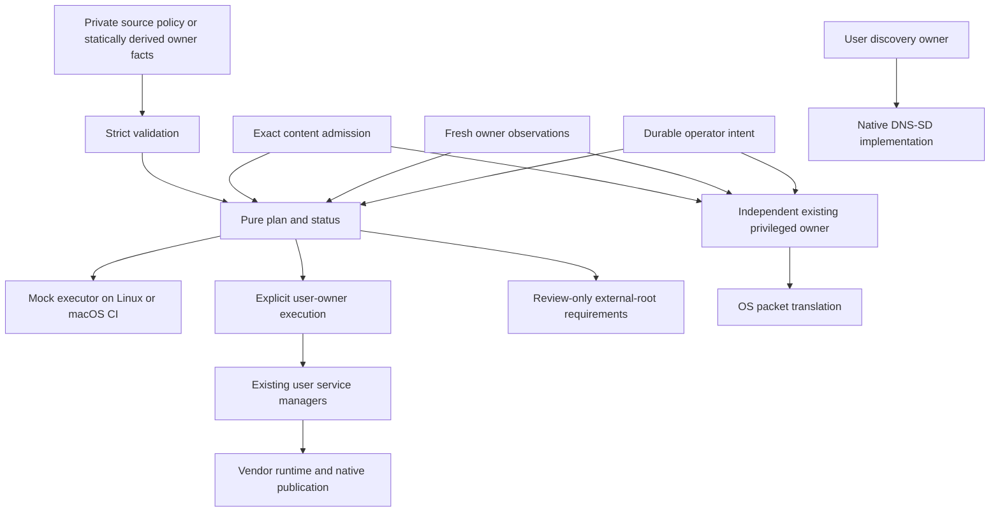

# Architecture

Netorch provides a reusable control layer for networking owned by other systems.
It has no packet stack, workload runtime, privileged RPC or automatic upgrade path.
The implementation is alpha: portable tests establish model and owner-contract
behavior. Platform and application acceptance remain separate deployment work.

## Goals

1. Correct behavior and predictable recovery.
2. Maintainable policy with one authoring location per setting.
3. Meaningful tests and bounded resource/process behavior.
4. A common operator workflow while preserving existing privilege and failure domains.

Misdelivery, implicit admission, lost pause, unknown-as-success and concealed partial
completion are release blockers. A language choice or lower process count cannot
compensate for those failures.

There is deliberately no execution arrow from the planner into the privileged
owner. That owner independently pulls protected admitted content, observes the
runtime, withdraws unsafe rules and invalidates its retained states. A desired
catalog and an unprivileged plan are not root authority.

## Data versus logic

| Category | Authority / lifetime | Content |
|---|---|---|
| Desired | Reviewed private source | Services, scopes, named strategies, ports, dependencies |
| Admitted | Independently protected owner record | Profile ID plus exact resolved digest and risk acceptance |
| Observed | Short-lived evidence | Service instance, network generation, endpoint and real readback |
| Applied | Completion receipt | Verified past operation, never current truth |
| Transition | Durable private journal | Reviewed plan, initial facts, intent, phase and completed steps |

Operator pause and operation suspension are independent fields. Their effective
union inhibits activation. Neither expires by time. Recovery, release reinstall or
rollback cannot clear operator pause. Missing/corrupt intent inhibits execution.

Logic lives in the typed Python package: strict codec, validation, pure planner,
discovery selection/projection, owner clients, fenced executor and private store.
Host data lives outside the checkout. Existing applications keep their own secrets,
pairings, routes and persistent databases.

Services have observation owners. Each transport profile can independently select
an execution owner. This represents a user runtime manager, an external root
forwarding owner and a user discovery owner without merging their privileges.

## Named transport contracts

- `publication`: a runtime-owned host port mapping.
- `host-redirect`: a scoped redirect to the same service's verified native host
  publication. A coincident listener owned by another service is insufficient.
- `guest-direct`: a validated dynamic guest endpoint; bounded-risk admission is
  required because shared addresses can be reused.
- `udp-return`: separate source-port-preserving outbound NAT and inbound target-less
  redirect. Automatic guest range and admitted return range must be equal.

`render-pf` is a pure preview. It does not load rules, establish anchor/hook
precedence, enable PF or certify packet semantics. The UDP return redirect has no
replacement target-port expression; the OS behavior still needs hardware acceptance.
Apple documents PF as a site-administrator facility rather than an application API:
https://developer.apple.com/documentation/technotes/tn3165-packet-filter-is-not-api

Structural policies declare fixed ownership; direct guest policies explicitly
acknowledge a bounded observation/address-reuse race. The planner retires known
exposure immediately on uncertain identity; `unknown_limit` is an upper bound for
an existing owner's reader retries, not permission for this planner to retain stale
targets. No periodic observer can prove a zero-duration race after every crash.

## Discovery

Discovery and transport remain independent. Pure selectors require exact source
service/generation provenance, unique publication mapping, explicit interfaces,
fresh records, dependency readiness and bounded record counts. TXT is represented
losslessly as bytes/base64. Related Apple-media records must share an eligible
AirPlay endpoint. Discovery is not authentication or PF admission.

Live DNS-SD registration remains the responsibility of an existing discovery owner.
The package coordinates that owner's fixed activation/cleanup operation using
record/projection contracts, exact dependency evidence and current service/network
generations. Publication cleanup is processed before transport writes; an
unavailable publisher remains pending. A new or changed publisher first establishes
complete scoped absence, then a later fresh cycle may activate it. The coordinator
does not install a second reflector or replace its long-lived publisher. See the
owner protocol for adapting the existing implementation. This boundary preserves
native process/consent identity; portable tests do not establish platform acceptance.

## Failure behavior

Observations have exactly three decisions: present, absent, unknown, with closed
reasons and ages. Incomplete, denied, busy, malformed and timed-out readers remain
unknown. Unknown cannot initiate workload recovery. A changed guest/network
generation retires old targets before a later fresh plan may activate a replacement.

The executor checks durable intent, exact reviewed actions and fresh non-time
evidence under one owner lock. Owners then independently check their own operation
preconditions. Successful activation requires exact policy/target/generation
readback. Withdrawal and state drain are separate operations. Interrupted or
unknown-format journals inhibit further work; no speculative automatic rollback
runs. See [the executable state contract](state-machine.md).

## Native / custom / third-party roles

| Role | Implementation |
|---|---|
| Packet transport/runtime | Existing OS/vendor system |
| Discovery packets | Existing native DNS-SD owner |
| Scheduling/recovery | Existing launchd, Monit or equivalent owner |
| Config validation | Netorch with maintained `jsonschema` |
| Policy planning / mock orchestration | Netorch Python |
| Platform mutation | Independently admitted existing owners |
| Tests | pytest, Hypothesis, real-format synthetic fixtures |
| Packaging and CI | Standard Python wheel/sdist, GitHub Actions |

Consolidation means shared contracts and a clear operator workflow. It does not
mean one privileged daemon controls packets, pairing, application configuration,
runtime restart and discovery.
