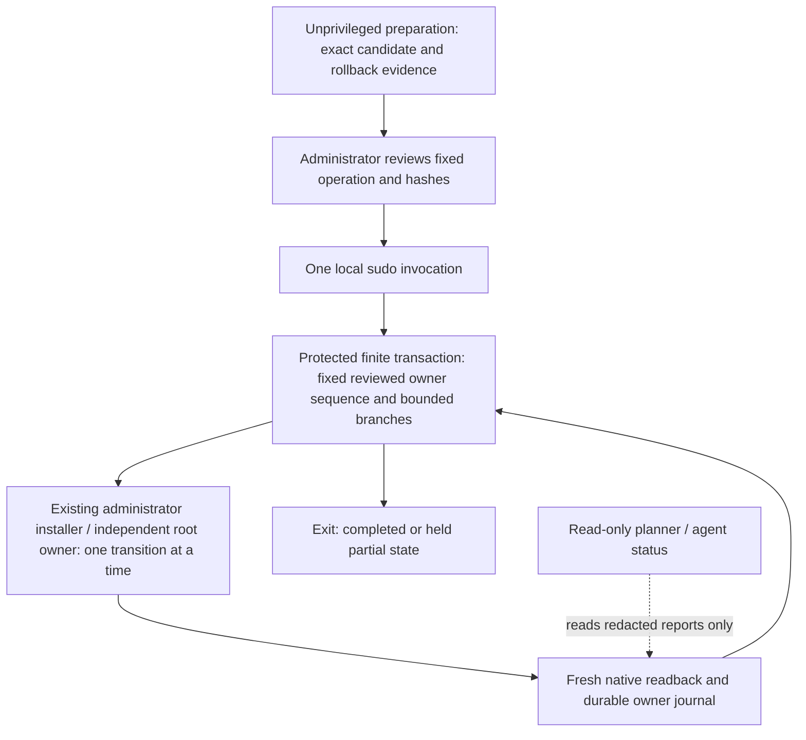

# One authenticated migration session: design and limits

**Preparation only. No session runner is implemented or enabled.** This proposal
does not qualify a native mutation, install a helper, or replace an existing
owner. The public mutation gate remains closed. Read it with the
[migration readiness record](migration-readiness.md),
[owner runbook](migration-runbook.md), [site migration](site-migration.md) and
[existing installation contract](provisioning.md).

One local authentication can cover a finite administrator transaction while its
privileged process stays alive. It cannot safely cover an unlimited sequence of
new fixes, changed programs or new deployment bundles. The scope can be one
bounded, preapproved migration window containing an immutable sequence of owner
transitions. Bind each owner's exact candidate, retained predecessor and bounded
retry/recovery branches before authentication. Only one owner flips at a time,
with a complete health checkpoint between transitions. A later candidate needs a
new administrative invocation; authenticating once is not a lasting privilege
grant to the planner or to an agent.
Owners cannot be added or reordered after authentication. Each transition has
its own durable holder and journal. An unexpected failure stops the remaining
sequence; it does not automatically roll back owners already completed.

## What the operating system provides

The installed `sudo(8)` and `sudoers(5)` manuals inspected during preparation
identify their documentation as Sudo 1.9.17p2. They document terminal/parent-bound
credential caching, noninteractive refusal, execution credentials, command
timeouts and signal forwarding. This is manual/source evidence, not an inspection
of the effective local sudo policy or a native authentication experiment.

The distinction matters:

| Mechanism | Meaning for this design |
|---|---|
| `sudo -v` | Refreshes a policy-dependent credential timestamp. It is not a capability bound to a deployment digest. |
| Timestamp scope | Usually per terminal; without a terminal, parent-process scope can apply. Another terminal, tool invocation or login session may need authentication again. Do not assume a configured duration. |
| `sudo -n` | Refuses instead of prompting when authentication is required. It does not establish that a later command will be permitted. |
| One foreground command | After successful policy/authentication checks, the command executes with the selected credentials. Its already-running children do not need a new sudo invocation for each fixed step. A command timeout or session termination can still end it. |
| `sudo -k` with a command | Requests authentication without updating the credential cache, where that policy requires it. It is a possible launch choice, not a policy bypass. |
| Sudo `-T` | User-supplied timeouts require policy permission. Do not depend on it or change sudoers to obtain it; the transaction must have its own bounds. |

These facts follow from the installed manuals and the corresponding
[upstream sudo manual at 1.9.17p2](https://github.com/sudo-project/sudo/blob/v1.9.17p2/docs/sudo.man.in)
and [sudoers manual](https://github.com/sudo-project/sudo/blob/v1.9.17p2/docs/sudoers.man.in).
No sudo command was run for this investigation.

Root credentials do not establish the correct user bootstrap namespace or Local
Network consent identity. Apple distinguishes root and login sessions; changing
UID is not proof of equivalent launch context. User-owner steps must continue in
their existing declared context. Logout, terminal loss, policy termination and
reboot can end the transaction. There is no promise that a foreground root
process survives any of them. See Apple's
[root and login sessions](https://developer.apple.com/library/archive/documentation/MacOSX/Conceptual/BPMultipleUsers/Concepts/SystemContexts.html)
and [process lifecycle](https://developer.apple.com/library/archive/documentation/MacOSX/Conceptual/BPSystemStartup/Chapters/Lifecycle.html).

## Selected concept and rejected shortcuts

The possible future component is an **administrator-invoked, finite transaction
program**, installed as reviewed root-owned code. It exits at completion, expiry
or an unhandled failure. It is not a launchd job, daemon, service, privileged
shell or server. It has no command socket, FIFO, writable inbox, HTTP endpoint,
XPC method, stdin command loop or dynamic plug-in. The unprivileged host-view
commands remain unable to launch it or send it work.

This is a proposed new administrative orchestration boundary and needs its own
code review and proving tests before implementation or activation. It is not
justified by renaming an interactive root shell. The accepted design forbids a
planner-to-root call and a root-owner rewrite; neither is introduced here. The
existing root owner retains its independent observations, policy admission,
kernel ownership, state drainage and scheduling. A session cannot lower those
checks or manufacture qualification.

Do not use a timestamp keepalive loop, `NOPASSWD`, a wider sudoers rule, an
askpass/password pipe, stored password, root shell, mutable downloaded script,
or an always-running privileged helper. They either do not guarantee continuity
or extend authority beyond the fixed transaction. Do not detach using `nohup`,
`sudo -b` or a newly installed launchd job to claim survival. Do not modify sudo,
PAM, Terminal or logging policy.

## Bootstrap and staging contract

There are two distinct prerequisites: trusted executable code and approved
deployment data. A file hash supplied beside a user-editable program does not
make that program safe to execute as root.

1. **Start from a trusted interpreter and package.** The managed interpreter,
   standard library, dependencies, transaction program and owner entrypoints
   must already be installed from independently reviewed, pinned artifacts in
   protected administrator-owned locations. Bind their identities and hashes.
   Verify physical executable paths and every ancestor, including ACLs, before
   execution. Use isolated Python mode and never import the checkout, a user
   virtual environment or a user site package. The existing root installer
   requires a protected physical interpreter path; its symlink restrictions
   still apply. If this bootstrap does not exist, stop: its separate reviewed
   administrator installation is required. This document promises no one-prompt
   shortcut for first establishing root-code trust.
2. **Freeze one administrative window.** Bind its immutable owner order, and for
   each transition bind the owner, framework artifact
   and dependency-lock hashes, private instance commit, schema, resolved policy
   digests, exact candidate bundle, retained predecessor, installed labels and
   permitted output/state roots. Bind any specifically authorized recovery
   branch and required full-roster checkpoint. Numeric retry/output/time limits
   for each transition and the complete window must be finite and within reviewed
   code limits. This is a local administrative request, not executable instance
   data. No command line, shell text, module name, interpreter selection or
   arbitrary path/operation pair is accepted from the instance or planner.
3. **Capture before use.** Treat user staging as untrusted bytes. With trusted
   code, open bounded single-link regular files without following links, reject
   extra entries and noncanonical/unknown/duplicate JSON members, verify the
   independent expected digest, and copy only the closed inventory to a fresh
   private root-owned staging directory. Do not extract an unchecked archive or
   run a build/package installer there. Recheck descriptor metadata/content
   during capture, then verify the protected copy. Subsequent steps read that
   copy, never a user-writable original. Source replacement must either yield
   the approved exact bytes or refuse, never silently change the operation.
4. **Validate the destination independently.** Reject replaceable ancestors,
   ACLs, symbolic/hard links, foreign jobs, wrong ownership, unexpected files,
   mutable interpreter/dependency roots and log-path substitutions. Existing
   [deployment trust checks](../src/netorch/deployment.py) remain authoritative;
   the session adds no permissive alternate reader. The report directory stays
   separately protected and readable, outside private admission/state trees.
5. **Check readiness before a write.** Require the qualified platform/owner
   release, complete semantic consumer review, byte conformance, current native
   observations, independent admissions, preserved negative intent, single
   writer, valid exact rollback material and a rehearsed restore where required.
   A copied acceptance label is not evidence. The current
   [workflow gate](../src/netorch/workflow_gate.py) refuses mutation even with
   root credentials; the session must call public gated entrypoints, never their
   internal implementations to evade that refusal.
6. **Authenticate locally and narrowly.** The administrator invokes the exact
   protected entrypoint in a local terminal, with only the staged request's
   identity/digest as its selector. The program never reads an administrator
   password. Sudo handles authentication directly. The public repository
   intentionally provides no executable launch command for an unimplemented
   runner. Authentication is not an admission or permission to bypass a gate.
7. **Constrain the process.** Require the declared UID/GID, a private working
   directory, restrictive umask, closed environment and file descriptors, fixed
   absolute executable argument arrays, isolated imports, combined output
   bounds and per-step plus total deadlines. Never inherit package search paths,
   askpass hooks, shell startup files or arbitrary environment additions. No
   network downloads, package upgrades or new code during the transaction.

Preflight failure before mutation leaves the existing installation unchanged.
If staging has occurred, retire only that operation's unreferenced staged files,
after checking its journal and retained references. Existing owner records,
locks, suspensions and recovery material are not temporary staging.

## Operation sequence and retry boundaries

For each future qualified owner migration, the exact operation keeps the existing
sequence: take its own durable suspension; verify owned withdrawal and state
drainage; perform the single-owner installation; verify job identity and current
state; verify the required transport/discovery generation; release only its own
suspension when every gate permits it. Verify the complete reviewed dashboard
roster and the owner's independent native acceptance conditions before proceeding
to the next owner. The window's preapproved order does not authorize overlapping
flips or continuing after a failed checkpoint. Operator pause, service holds and other
holders remain effective throughout. No runtime or user-owner action is moved
into root merely to save an authentication prompt. The foreground session may
wait within its budget while those already approved user-owner steps run in their
established context. It observes their existing bounded, identity-checked records
and the separately trusted checkpoint result; it accepts no user command channel
or substitute executable. A saved green health JSON is not authenticated evidence
or root admission and cannot authorize releasing a root hold. Root does not
execute user-owned scripts or alter their launch context to maintain one prompt.
If the correct user context or trusted completion cannot be
established, retain the hold and stop. Root work runs only at the fixed phases
that require it; user application work never inherits root credentials.

| Result | Permitted continuation within the same live session |
|---|---|
| Explicit lock-busy result proving no write | Retry the same exact operation within the already approved attempt/time budget. Never unlink a lock or infer that its holder died from age alone. |
| Read-only transient failure | A bounded reread can collect fresh evidence; until complete, state remains unknown. No recovery/start or widened scope follows from it. |
| Idempotent same-bundle step, with verified before/after state | Repeat only when that entrypoint documents this exact interruption case. A nonzero exit is not automatically retryable. |
| Partial write or in-progress journal | Hold. Use an explicitly preauthorized exact-phase recovery branch only after its own native/retained-state preflight proves applicability. Otherwise stop for inspection. Never blanket-acknowledge a failed journal. |
| Known completed installation requiring rollback | Rollback is a separate, explicitly authorized branch bound to the exact current and predecessor digests; revalidate all retained code, boundaries and current negative intent. No speculative automatic rollback. |
| Changed bytes, scope, owner, platform, authority or unexpected state | Stop; retain the hold and evidence. A new reviewed operation is required. |
| Session or time budget expires, terminal lost, process dies, reboot | No new step. Preserve durable holds/journals. A later explicitly authenticated invocation must observe fresh state and recover under the existing owner protocol. |

The existing deployment implementation already supplies bounded owner-busy
retry, phase-aware recovery and explicit rollback. Reuse those semantics rather
than looping every command until it succeeds. A retained failed release cannot
simply be overwritten; a new release falls outside the original session's
authority. A session can handle anticipated transient errors and reviewed
interruption cases. It cannot keep accepting repairs invented after the initial
authentication without becoming a general root execution interface.

The session has a hard overall budget and reserves time for its defined safe
termination. Retry counts and delays cannot reset that budget. After host sleep,
revalidate elapsed time and all observations before any further step; if the
deadline cannot be established conservatively, stop. Wall-clock rollback cannot
extend the session. Catchable interrupts stop owned subprocesses, record the
phase when possible, and retain holds. No cleanup handler resumes networking.

Killing the parent cannot be assumed to kill every child: sudo's manual
distinguishes signal forwarding from uncatchable signals, and the existing
bounded process runner uses separate process groups. A future session must
prove cleanup for owned process groups, enforce each child's deadline, and
reconcile any child that outlived the parent before retrying. `SIGKILL`, power
loss and kernel hangs can prevent cleanup or final journalling. In those cases
the last durable phase remains authoritative evidence of incompleteness, not
proof that the operation did or did not take effect. Do not delete a lock while
an old child might still hold it.
Deliberately installed independent launchd owner jobs are not transaction child
cleanup targets; their stop/recovery remains with the reviewed owner procedure.

## Required tests before implementation can be activated

All tests below begin with fake native effects and synthetic identifiers. They
are proposed tests, not claims of an implemented session. Existing tests in
`test_deployment_security.py`, `test_deployment_interrupted_install.py`,
`test_deployment_recovery.py`, `test_deployment_rollback_reentrant.py`,
`test_service_holds_deployment.py` and `test_process.py` are building blocks;
their passage alone cannot qualify a new administrative entrypoint.

| Area | Counterexamples and required proof |
|---|---|
| Authority | Planner/provider cannot start the session or submit work. Unknown verbs, raw argv, shell text, executable paths in instance data, alternate modules and appended requests are refused before native effects. A privileged caller cannot bypass `workflow_gate`. |
| Bootstrap | User-owned interpreter/package/ancestor, dependency replacement, executable symlink, permissive mode or ACL, foreign log leaf and import-path injection refuse. No user-staged code executes while its hash is being checked. |
| Capture | Source changes before/during/after capture; link/hardlink/FIFO/device substitution; path traversal; extra files; duplicate keys; noncanonical, oversized and nested inputs. Only immutable expected bytes reach the transaction. |
| Binding | Wrong candidate, predecessor, instance commit, policy digest, owner, namespace or code lock refuses. A valid receipt cannot replace current code or kernel readback. |
| Retries | Only documented no-write busy results retry; finite attempt/total budgets; ordinary error does not retry; a success followed by lost output is reobserved, never replayed blindly. Deadlocks and partial writes keep the hold. |
| Interruption | Interrupt at every journal/native boundary and during recovery/rollback. Reentrant recovery follows current journals; no duplicate owner, lost pause, abandoned child or unsupported automatic rollback. |
| Negative intent | Operator pauses during install; another holder appears; corrupt/old-version intent; rollback predates a pause. Every sequence preserves the union of current negative authority. |
| Freshness | Runtime/network generation changes between checks; old handler job reappears; readback truncates or succeeds empty. Unknown never becomes activation/recovery permission. |
| Process control | Timeout, output flood, held pipes, child/grandchild, process-group change and parent death. Cleanup only targets owned processes; retained ambiguity blocks a second transaction. No new step begins after expiry or sleep without valid time/freshness. |
| Recovery bounds | Missing/mutated predecessor, failed rollback readback, foreign installed label, retained failed directory and write-in-doubt all refuse. No time-based removal of suspension, journals or locks. |
| Privacy | Password can never enter program input, arguments, environment or logs. Errors and reports contain bounded stage/reason/hash metadata, never credentials, raw container inspect data or packet payloads. |
| Completion | Success requires full readback, then release of exactly the operation's own holder. Failure and failed cleanup retain a truthful partial state. Subsequent provisioning is a verified no-op. |

Process-model tests can exercise harmless subprocesses as the normal CI user;
they must never invoke sudo or an actual PF/launchd mutation. Separate authorized
macOS qualification must test real authentication/session policy, protected
staging and launch context, terminal loss and interruption cleanup. Guest packet
paths, DNS client identity, real discovery, audio, restore and unattended reboot
keep their own proving tiers. No mock or timestamp test substitutes for them.

## Decision

Prepare the frozen ordered owner transactions and their proofs first. Prefer the
existing explicit administrator entrypoint where it is sufficient. Implement a
finite session program only if a qualified migration genuinely needs several
root steps across a bounded migration window under one authentication, and review
that new boundary separately. Each owner still has its own transaction,
rollback boundary, negative intent and full-health checkpoint.
Until then, the honest operating guarantee is **one authentication for the
already reviewed live transaction, not for all future repairs**.
